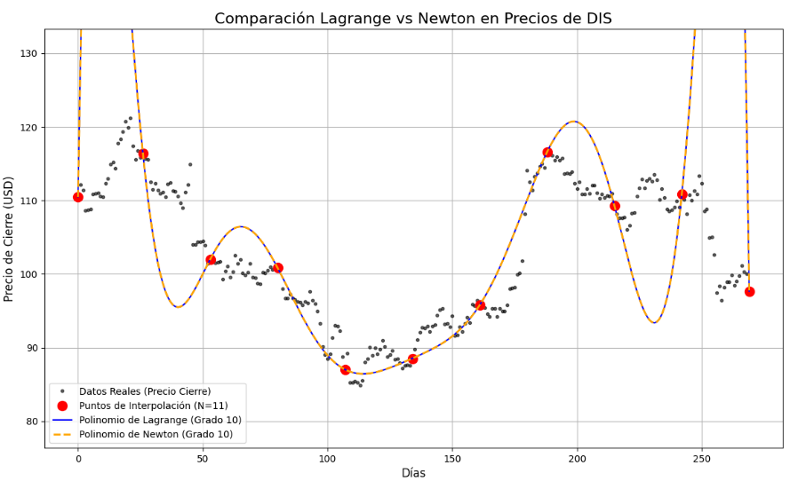

# Interpolación Polinómica de Datos Históricos

## 1. Descripción del Proyecto

En este proyecto para el curso de Métodos Numéricos, seleccionamos un método de la unidad de **Ajuste de Curvas** para aplicarlo a un problema del mundo real. El objetivo es aplicar los conocimientos teóricos para resolver un problema usando técnicas computacionales.

* **Métodos Seleccionados:** Interpolación Polinómica (implementando el **Polinomio de Lagrange** y el **Polinomio de Newton** por diferencias divididas).
* **Problema Real:** Analizar el comportamiento de los precios históricos de una acción, tratando los datos como un conjunto de puntos (día, precio).

## 2. El Problema: Interpolación de Puntos de Datos

El objetivo es construir un modelo matemático (un polinomio) que pase exactamente por un conjunto de puntos de datos históricos.

Usaremos `N+1` puntos (días) de los datos de una acción para construir un polinomio de interpolación de grado `N`. Luego, analizaremos visualmente qué tan bien este polinomio describe la tendencia general de los datos, o si sufre de oscilaciones no deseadas.

Seguiremos las siguientes ecuaciones:

**Polinomio de Lagrange:**

$$
P(x) = \sum_{i=0}^{N} y_i \cdot L_i(x)
$$

Donde $L_i(x)$ es el polinomio base de Lagrange:

$$
L_i(x) = \prod_{\substack{j=0 \\ j \neq i}}^{N} \frac{x - x_j}{x_i - x_j}
$$

**Polinomio de Newton (Diferencias Divididas):**

$$
P(x) = b_0 + b_1(x-x_0) + b_2(x-x_0)(x-x_1) + \dots + b_n(x-x_0)\dots(x-x_{n-1})
$$

Donde los coeficientes $b_i$ se calculan usando la tabla de diferencias divididas.

**Este proyecto NO busca predecir el futuro**, sino analizar críticamente las propiedades matemáticas y las limitaciones de la interpolación polinómica cuando se aplica a datos con variaciones.

## 3. Análisis de Resultados y Conclusiones

Realizamos dos experimentos para analizar el comportamiento del método bajo diferentes condiciones.

### Experimento 1: Polinomio de Alto Grado (Grado 10)

Inicialmente, ejecutamos el proyecto con 11 puntos de interpolación para generar un polinomio de Grado 10.



**Discusión del Experimento 1:**

1.  **Eficacia:** Los métodos de Lagrange y Newton convergieron perfectamente al mismo polinomio.
2.  **Limitaciones:** A pesar de la corrección matemática, el método resultó **extremadamente inadecuado**. El gráfico expuso una limitación severa:
    * **Oscilación Extrema:** El polinomio de Grado 10 oscilaba violentamente entre los puntos, especialmente en los extremos, disparándose a valores irreales.
    * **Sobreajuste:** El polinomio modeló el "ruido" de los 11 puntos, ignorando la tendencia real.
3.  **Conclusión Parcial:** La interpolación polinómica de **alto grado** es numéricamente inestable y poco práctica para estos datos.

---

### Experimento 2: Polinomio de Bajo Grado (Grado 4)

Basado en las limitaciones del Grado 10, nuestra hipótesis fue que el problema era el **alto grado** del polinomio. Repetimos el experimento, pero esta vez reduciendo drásticamente los puntos de interpolación a **5 puntos** (generando un polinomio de **Grado 4**).

Este fue el resultado:


**Discusión del Experimento 2:**

1.  **Eficacia:** Nuevamente, Lagrange y Newton convergen perfectamente (línea azul y naranja) y pasan por los 5 puntos rojos.
2.  **Solución a la Limitación:** Como se observa, el polinomio de Grado 4 es **suave y estable**. Las oscilaciones violentas han **desaparecido por completo**. La curva resultante sigue una tendencia general mucho más creíble y se mantiene dentro del rango de los datos reales.

### Conclusión Final del Proyecto

El proyecto demuestra que, si bien la interpolación polinómica (Lagrange/Newton) es matemáticamente correcta, su aplicación práctica **depende críticamente del grado del polinomio**:

* **Conclusión 1:** Los polinomios de **alto grado** (ej. Grado 10) son numéricamente inestables cuando se usan con puntos equiespaciados, lo que provoca oscilaciones severas.
* **Conclusión 2:** Al **reducir el número de puntos (ej. a Grado 4)**, el método se vuelve estable y produce una curva suave que puede ser útil para un análisis de tendencia simple, **resolviendo la limitación** observada en el primer experimento.

## 4. Instalación y Dependencias

Para ejecutar este proyecto, necesitas Python 3.x y las siguientes bibliotecas. Puedes instalarlas usando `pip`:

```bash
pip install -r requirements.txt
