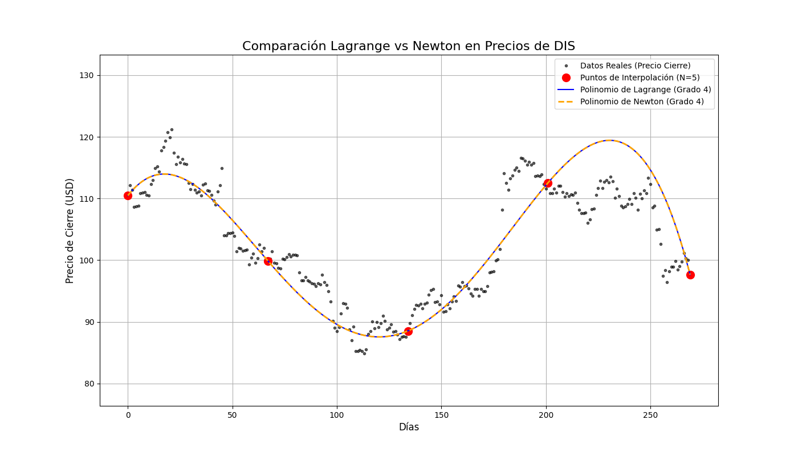

# Interpolación Polinómica de Datos Históricos

## 1. Descripción del Proyecto

En este proyecto para el curso de Métodos Numéricos, seleccionamos un método de la unidad de **Ajuste de Curvas** para aplicarlo a un problema del mundo real. El objetivo es aplicar los conocimientos teóricos para resolver un problema usando técnicas computacionales.

* **Métodos Seleccionados:** Interpolación Polinómica (implementando el **Polinomio de Lagrange** y el **Polinomio de Newton** por diferencias divididas).
* **Problema Real:** Analizar el comportamiento de los precios históricos de una acción, tratando los datos como un conjunto de puntos (día, precio).

## 2. El Problema: Interpolación de Puntos de Datos

El objetivo es construir un modelo matemático (un polinomio) que pase exactamente por un conjunto de puntos de datos históricos.

Usaremos `N+1` puntos (días) de los datos de una acción para construir un polinomio de interpolación de grado `N`. Luego, analizaremos visualmente qué tan bien este polinomio describe la tendencia general de los datos, o si sufre de oscilaciones no deseadas (Fenómeno de Runge).

Seguiremos las siguientes ecuaciones:

**Polinomio de Lagrange:**

$$
P(x) = \sum_{i=0}^{N} y_i \cdot L_i(x)
$$

Donde $L_i(x)$ es el polinomio base de Lagrange:

$$
L_i(x) = \prod_{\substack{j=0 \\ j \neq i}}^{N} \frac{x - x_j}{x_i - x_j}
$$

**Polinomio de Newton (Diferencias Divididas):**

$$
P(x) = b_0 + b_1(x-x_0) + b_2(x-x_0)(x-x_1) + \dots + b_n(x-x_0)\dots(x-x_{n-1})
$$

Donde los coeficientes $b_i$ se calculan usando la tabla de diferencias divididas.

**Este proyecto NO busca predecir el futuro**, sino analizar críticamente las propiedades matemáticas y las limitaciones de la interpolación polinómica cuando se aplica a datos con variaciones.

## 3. Análisis de Resultados y Conclusiones

Tras ejecutar el proyecto con los datos del activo "DIS" (Disney) durante un período de 270 días, se generó el siguiente gráfico de análisis comparativo:



### Discusión de los Resultados

1.  **Eficacia: Funcionó?**
    Sí, ya que como se observa, la línea azul (Polinomio de Lagrange) y la línea naranja punteada (Polinomio de Newton) pasan perfectamente por cada uno de los 11 Puntos de Interpolación. Esto valida que nuestras implementaciones son matemáticamente correctas y, lo más importante, comprueba visualmente la teoría: ambos métodos (Lagrange y Newton) convergen al único polinomio de interpolación que existe para este conjunto de puntos.

2.  **Limitaciones**
    A pesar de su corrección matemática, el método es extremadamente inadecuado para este problema real. El gráfico expone una limitación severa:

    - **Oscilación Extrema (Fenómeno de Runge):** En lugar de seguir la tendencia general de los "Datos Reales" (puntos negros), el polinomio (ambas curvas, azul y naranja) oscila violentamente entre los puntos de interpolación. Esto es especialmente notorio en los extremos del intervalo (días 0-50 y días 240-270), donde el polinomio se "dispara" a valores irreales.
    - **Sobreajuste:** El polinomio de Grado 10 se "sobreajusta" a los 11 puntos que le dimos. Es tan sensible que en lugar de capturar la tendencia suave del precio, intenta modelar el "ruido" (la volatilidad diaria). El resultado es un modelo que es inútil para cualquier tipo de análisis o predicción.

3.  **Desviaciones y Errores**
    La "desviación" observada es la gran diferencia vertical entre la curva polinómica (ahora visible tanto en azul como en naranja) y los datos reales (negro) en la mayoría de los días. Este error no es un error de código, sino una característica matemática inherente a la interpolación polinómica de alto grado con puntos equiespaciados.

### Conclusiones y Posibles Mejoras

El proyecto demuestra exitosamente que, aunque un método numérico sea matemáticamente correcto, su aplicación a un problema real debe ser crítica.

- **Conclusión Principal:** La interpolación polinómica de alto grado (tanto por Lagrange como por Newton) no es un método efectivo para analizar datos financieros o series de tiempo con ruido. El Fenómeno de Runge domina el resultado y lo invalida para cualquier uso práctico en este contexto.

## 4. Instalación y Dependencias

Para ejecutar este proyecto, necesitas Python 3.x y las siguientes bibliotecas. Puedes instalarlas usando `pip`:

```bash
pip install -r requirements.txt
